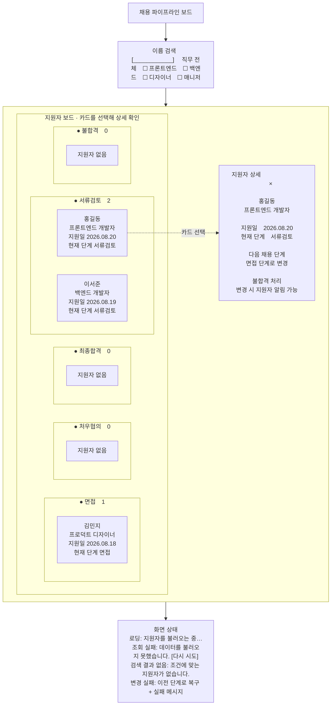

# 채용 파이프라인 보드 와이어프레임

레퍼런스: [나인하이어 ATS](https://blog.ninehire.com/tip-ats-recruitment-solution)

- 단계 변경: 카드 선택 후 상세 패널의 현재 상태별 액션을 명시적으로 확인
- 상세 보기: 카드 선택 시 우측 사이드 패널 표시



## 화면 명세

### 1. 목적과 범위

- 경로: `/`
- 사용자: 여러 지원자의 진행 상태를 관리하는 채용 담당자
- 핵심 작업: 단계별 현황 확인, 이름 검색, 직무 필터, 단계 이동, 상세 확인
- 구현 우선순위: `docs/requirements.md`의 Must를 먼저 완료한다.
- 레퍼런스는 나인하이어의 정보 구조와 카드형 보드 패턴에 한정해 사용한다. 채용 공고 관리, 평가, 메시지, 일정 기능은 가져오지 않는다.
- 화면은 데스크톱 우선으로 설계한다. 화면 너비가 부족하면 컬럼을 줄이거나 재배치하지 않고 보드 영역을 가로 스크롤한다.

### 2. 화면 구조

| 구역 | 위치 | 표시 내용 | 사용자 동작 |
| --- | --- | --- | --- |
| 페이지 헤더 | 화면 상단 | `채용 파이프라인 보드` 제목 | 없음 |
| 검색·필터 | 헤더 아래 | 이름 검색 입력, 직무 체크박스 | 입력 즉시 결과 갱신 |
| 파이프라인 보드 | 본문 | 5개 채용 단계 컬럼 | 가로 스크롤 |
| 단계 컬럼 | 보드 내부 | 단계명, 현재 조건에 해당하는 인원수, 지원자 카드 | 없음 |
| 지원자 카드 | 각 단계 컬럼 | 이름, 직무, 지원일, 현재 단계 | 선택 시 상세 패널 |
| 상세 패널 | 화면 오른쪽 오버레이 | 선택한 지원자의 필수 정보와 상태별 변경 액션 | 다음 단계 변경·불합격 처리, 닫기 버튼, `Escape`로 닫기 |
| 상태 메시지 | 보드 또는 화면 우측 하단 | 로딩, 조회 실패, 빈 결과, 이동 실패 | 재시도 또는 자동 소멸 |

### 3. 레이아웃

- 페이지는 세로로 `헤더 → 검색·필터 → 보드` 순서다.
- 페이지 기본 여백은 `24px`, 주요 구역 간격은 `16px`를 사용한다.
- 보드는 남은 화면 높이를 사용하며 보드 내부에서 세로·가로 스크롤이 가능해야 한다.
- 컬럼 순서는 항상 `서류검토 → 면접 → 처우협의 → 최종합격 → 불합격`으로 고정한다.
- 각 컬럼은 동일한 너비(`288px`)를 사용하고 컬럼 간 간격은 `12px`로 한다.
- 상세 패널은 데스크톱에서 오른쪽에 `420px` 너비로 표시한다. `640px` 미만 화면에서는 전체 너비를 사용한다.
- 상세 패널이 열려도 보드 데이터와 선택된 카드의 위치는 유지한다.

### 4. 영역별 상세 명세

#### 4.1 페이지 헤더

- 제목은 `채용 파이프라인 보드`로 고정한다.
- 요구사항에 없는 뒤로 가기, 공고 상태, 지원자 추가 버튼은 표시하지 않는다.

#### 4.2 이름 검색

- 레이블: `이름 검색`
- 플레이스홀더: `지원자 이름 검색`
- 입력값의 앞뒤 공백을 제거한 뒤 지원자 이름에 부분 일치하는 항목을 표시한다.
- 영문이 포함된 이름은 대소문자를 구분하지 않는다.
- 빈 값이면 이름 조건을 적용하지 않는다.
- 별도 디바운스 없이 입력값을 목록 GET API의 이름 조건으로 즉시 전달하고, API가 전체 데이터에서 필터한 결과를 페이지 단위로 반환한다.

#### 4.3 직무 필터

- 레이블: `직무`
- 기본값: 모든 직무 체크(`전체`)
- 선택지는 현재 로드된 지원자 데이터의 직무 목록에서 중복을 제거해 만든다.
- 직무는 체크박스로 여러 개 선택할 수 있다.
- 선택한 직무끼리는 OR로 적용하고, 각 직무와 정확히 일치하는 지원자만 표시한다.
- 이름 검색과 직무 필터를 함께 사용하면 이름 조건과 선택된 직무 조건을 모두 만족한 지원자만 표시한다.
- 이름과 직무 조건은 단계 조건과 함께 목록 GET API에 전달하고, 페이지네이션보다 먼저 적용한다.
- 컬럼의 인원수는 전체 데이터가 아니라 현재 검색·필터 결과를 기준으로 계산한다.

#### 4.4 파이프라인 컬럼

- 모든 컬럼은 결과가 0명이어도 항상 표시한다.
- 헤더에는 단계명과 인원수를 표시한다. 예: `서류검토 2`.
- 다른 컬럼에 카드가 있지만 해당 컬럼만 비어 있으면 본문에 `지원자 없음`을 표시한다.
- 컬럼 색상은 단계 구분을 돕는 보조 정보로만 사용하며 단계명 텍스트를 항상 함께 표시한다.

#### 4.5 지원자 카드

카드는 다음 순서로 정보를 표시한다.

1. 이름: 카드에서 가장 강조하는 텍스트
2. 직무
3. 지원일: `YYYY.MM.DD` 형식
4. 현재 단계: 단계 배지 또는 `현재 단계 {단계명}` 문구

동작 규칙:

- 카드를 선택하면 상세 패널을 연다.
- 카드 자체에는 드래그앤드롭이나 단계 변경 액션을 제공하지 않는다.
- 단계 변경 성공 후 카드는 대상 컬럼에 그대로 유지한다.
- 단계 변경 실패 시 원래 컬럼과 원래 위치로 복구한다.

#### 4.6 지원자 상세 패널

- 패널 제목: `지원자 상세`
- 표시 정보: 이름, 직무, 지원일, 현재 단계
- `다음 채용 단계` 섹션: 현재 상태에 맞는 단일 버튼과 알림 가능성 안내를 표시한다.
- 정규 전이는 `서류검토 → 면접 → 처우협의 → 최종합격`으로 한정하며, 중간 단계 건너뛰기와 이전 단계 변경을 제공하지 않는다.
- `불합격 처리` 섹션: `서류검토`, `면접`, `처우협의`에서만 별도 위험 액션을 표시한다.
- 다음 단계가 없거나 `최종합격`·`불합격`인 상태는 해당 액션을 비활성화하거나 안내한다.
- 액션 버튼을 누르면 shadcn/ui 확인 모달에서 지원자 이름, 이전 단계, 대상 단계와 알림 가능성을 확인한다.
- 확인 모달을 취소하면 화면 상태와 API 요청을 만들지 않는다.
- 저장 중에는 두 섹션의 액션 버튼을 비활성화하고 `변경 중…`을 표시한다.
- 요구사항이나 데이터에 없는 연락처, 이력서, 평가, 메모, 단계 이력은 만들지 않는다.
- 닫기 방법: 우측 상단 닫기 버튼, `Escape`, 패널 바깥 영역 선택
- 변경을 확정하면 패널의 현재 단계 값도 즉시 갱신한다.
- 검색·필터 변경으로 선택한 지원자가 결과에서 제외되면 패널을 닫는다.

### 5. 단계 변경과 저장 흐름

1. 사용자가 카드를 선택해 지원자 상세 패널을 연다.
2. 현재 상태에 맞는 `다음 채용 단계` 또는 `불합격 처리` 액션을 누른다.
3. shadcn/ui 확인 모달에서 지원자 이름, 이전 단계, 대상 단계와 알림 가능성을 확인한 뒤 변경을 확정한다.
4. 화면 상태에서 카드의 단계를 즉시 대상 단계로 변경한다.
5. 상세 패널에 저장 중 상태를 표시하고 해당 지원자의 추가 변경을 막는다.
6. mock API에 변경된 단계를 저장한다.
7. 성공하면 저장 중 표시를 제거하고 현재 위치를 유지한다.
8. 실패하면 변경 전 단계로 복구하고 `단계 변경에 실패했습니다. 다시 시도해 주세요.` 메시지를 표시한다.

추가 규칙:

- 중간 단계 건너뛰기와 일반적인 이전 단계 변경은 허용하지 않는다. 직전 비종료 단계 변경 실행 취소만 예외다.
- 불합격 처리는 `서류검토`, `면접`, `처우협의`에서만 가능하다. `최종합격`과 `불합격`은 종료 상태다.
- 확인 취소는 변경으로 처리하지 않는다.
- 실패 메시지는 `role="alert"` 영역에 표시해 보조 기술에도 전달한다.
- 실패 메시지는 일정 시간 후 닫히거나 사용자가 직접 닫을 수 있어야 한다.
- 새로고침 후에는 mock API에 마지막으로 저장된 단계가 다시 표시되어야 한다.
- 실제 지원자 알림 발송은 범위 밖이며, 화면에서는 변경 전 영향 가능성만 고지한다.

### 6. 화면 상태

| 상태 | 표시 위치 | 표시 방식 | 사용자 동작 |
| --- | --- | --- | --- |
| 초기 로딩 | 보드 | 5개 컬럼 형태의 스켈레톤, 검색·필터 비활성화 | 대기 |
| 조회 실패 | 해당 컬럼 | 지원자 카드가 없으면 `지원자를 불러오지 못했습니다.`와 `다시 시도` 버튼 | 재조회 |
| 부분 조회 실패 | 해당 컬럼의 기존 카드 아래 | 기존 카드를 유지하고 미확정 인원수에 `+` 표시, `일부 지원자를 불러오지 못했습니다.` 또는 `추가 지원자를 불러오지 못했습니다.`와 `다시 시도` 버튼 | 재조회 |
| 전체 데이터 없음 | 컬럼 헤더 아래 | 모든 컬럼 인원수 `0`, `등록된 지원자가 없습니다.` | 없음 |
| 검색 결과 없음 | 컬럼 헤더 아래 | 모든 컬럼 인원수 `0`, `조건에 맞는 지원자가 없습니다.` | 검색·필터 변경 |
| 컬럼만 비어 있음 | 해당 컬럼 | `지원자 없음` | 없음 |
| 단계 저장 중 | 상세 패널 | `변경 중…`, 두 상태 변경 액션 비활성화 | 대기 |
| 단계 저장 실패 | 우측 하단 알림 | 실패 문구 표시 후 카드 롤백 | 알림 닫기 또는 재변경 |

### 7. 데이터와 mock API 계약

화면이 사용하는 최소 데이터는 다음과 같다.

```ts
type Stage =
  | "DOCUMENT_REVIEW"
  | "INTERVIEW"
  | "COMPENSATION_NEGOTIATION"
  | "HIRED"
  | "REJECTED";

type Applicant = {
  id: string;
  name: string;
  role: string;
  appliedAt: string;
  stage: Stage;
};
```

API는 영문 단계 코드를 사용하고 화면은 각각 `서류검토`, `면접`, `처우협의`, `최종합격`, `불합격`으로 표시한다.

- 목록 조회: `GET /api/applicants?stage={stage}&page={page}&name={name}&role={role}`
- `name`과 반복 가능한 `role`은 선택 조건이며, 이름 부분 일치·선택 직무 OR·단계 조건을 적용한 뒤 100건씩 페이지네이션한다.
- 단계 저장: `PATCH /api/applicants/:id/stage`
- 단계 저장 요청 본문: `{ "stage": "INTERVIEW" }`
- 최종합격 지원자를 불합격으로 변경하려는 요청은 `400` 응답으로 거부한다.
- 모든 mock API 요청에는 `200~800ms` 지연을 적용한다.
- 요청은 약 `15%` 확률로 실패하게 한다.
- MSW 핸들러가 사용하는 지원자 데이터는 브라우저 저장소에 보관해 새로고침 후에도 마지막 성공 상태를 유지한다.
- 실패한 단계 변경은 브라우저 저장소에 반영하지 않는다.

### 8. 시각 스타일 기준

- 시각 스타일은 shadcn/ui의 `base-nova`, `neutral` 기본 디자인을 기준으로 한다.
- 나인하이어는 정보 구조와 카드형 보드 배치만 참고하며 브랜드 색상이나 장식을 복제하지 않는다.
- 컬럼은 `muted`·`secondary`, 카드는 shadcn/ui Card의 기본 테두리·배경·그림자를 우선 사용한다.
- 단계 구분 색상은 헤더 점이나 배지에만 최소로 사용하고 단계명 텍스트를 항상 함께 표시한다.
- 본문 텍스트, 테두리, 배경, 상태는 `globals.css`의 기존 semantic token을 사용한다.
- shadcn/ui 컴포넌트의 기본 variant, 크기, radius, focus, motion을 요구사항 없이 재정의하지 않는다.
- 색상만으로 상태를 전달하지 않고 텍스트와 진행 표시를 함께 제공한다.
- 포커스 가능한 요소에는 눈에 보이는 포커스 링을 유지한다.

### 9. 구현 시 컴포넌트 사용 기준

- 재시도, 닫기와 단계 변경 동작에는 기존 `src/components/ui/button.tsx`를 재사용한다.
- 검색 입력, 직무 선택, 상세 패널, 스켈레톤은 기존 shadcn/ui 컴포넌트를 유지한다.
- `PipelineColumn`과 `ApplicantCard`는 도메인 UI이므로 페이지 가까이에 최소 단위로 작성한다.
- 변경 확정에는 shadcn/ui `AlertDialog`를 사용하며 별도 의존성을 추가하지 않는다.
- 한 화면에서만 사용하는 상태와 컴포넌트를 범용 레이어로 추상화하지 않는다.

### 10. 완료 확인 기준

- [ ] 최초 진입 시 로딩 상태 이후 지원자 목록이 표시된다.
- [ ] 5개 단계가 정해진 순서의 컬럼으로 항상 표시된다.
- [ ] 모든 카드에 이름, 직무, 지원일, 현재 단계가 표시된다.
- [ ] 이름 검색이 부분 일치로 동작한다.
- [ ] 직무 필터와 이름 검색을 동시에 적용할 수 있다.
- [ ] 검색·필터 결과에 맞춰 카드와 컬럼 인원수가 함께 갱신된다.
- [ ] 카드를 선택하면 우측 상세 패널이 열리고 이름, 직무, 지원일, 현재 단계가 표시된다.
- [ ] 상세 패널에 연락처, 이력서, 평가, 메모, 단계 이력 등 범위 밖 정보가 추가되지 않는다.
- [ ] 상세 패널의 다음 단계 또는 불합격 처리 액션을 확인하면 API 응답 전에 카드가 먼저 이동한다.
- [ ] 중간 단계 건너뛰기와 이전 단계 변경이 제공되지 않고, 불합격 처리는 `서류검토`, `면접`, `처우협의`에서만 제공된다.
- [ ] 확인을 취소하면 카드와 API 요청이 변경되지 않는다.
- [ ] 저장 성공 후 새로고침해도 이동한 단계가 유지된다.
- [ ] 저장 실패 시 카드가 원래 컬럼으로 복구되고 실패 메시지가 표시된다.
- [ ] 조회 실패 상태에서 `다시 시도`가 동작한다.
- [ ] 부분 조회 실패와 재시도 중에도 이미 표시된 지원자 카드가 유지된다.
- [ ] 전체 데이터 없음, 검색 결과 없음, 빈 컬럼이 구분되어 표시된다.
- [ ] 200건 이상의 지원자에서 검색·필터 조작에 체감 지연이 없다.
- [ ] 지원자 등록·수정·삭제 등 범위 밖 기능이 포함되지 않는다.

### 11. Must 완료 후 검토할 항목

다음 항목은 Should이므로 Must 완료 전에는 구현하지 않는다.

- 같은 카드의 빠른 연속 이동 경쟁 상태 처리 고도화
- 1,000건 기준 가상화 또는 추가 성능 최적화
- 현재 페이지에서 마지막으로 성공한 비종료 단계 변경 1건의 실행 취소. `최종합격` 또는 `불합격`으로 끝난 변경은 제외한다.
- 낙관적 업데이트와 롤백 테스트
- 키보드만으로 단계 이동과 상세 열람
